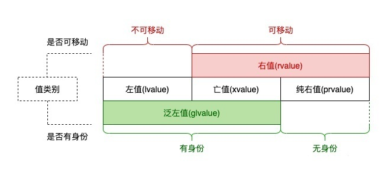

### 1 类型推导

#### 2.1 auto存储类

```c++
auto f = 3.1415926;              // double
auto s("hello");                 // const char*
auto z = new auto(9);            // int*
auto x1 = 5, x2 = 5.0, x3= 'r';  // 错误，必须是初始化为同一类型

int add(auto x, auto y);		// 错误，auto不能用于函数传参

// 错误，auto不能用于推导数组类型
int arr[10] = {0};
auto auto_arr = arr;
auto auto_arr2[10] = arr;

//使用较多的场景
for(auto itr = vec.cbegin(); itr != vec.cend(); ++itr);
```

#### 2.2 decltype推导类型

```c++
auto x = 1;
auto y = 2;
decltype(x+y) z;
```

#### 2.3 拖尾返回类型

* 传统写法

  ```c++
  template<typename R, typename T, typename U>
  R add(T x, U y) {
      return x+y
  }
  ```

* 改进后的写法（无法编译通过）
  ```c++
  decltype(x+y) add(T x, U y);
  ```

* 这是因为在编译器读到 decltype(x+y) 时，x 和 y 尚未被定义。（C++11）

  ```c++
  template<typename T, typename U>
  auto add(T x, U y) -> decltype(x+y) {
      return x+y;
  }
  ```

* C++14变的合法

  ```c++
  template<typename T, typename U>
  auto add(T x, U y) {
      return x+y;
  }
  ```

### 2 新For语句

* 常用的迭代写法

  ```c++
  std::vector<int> arr{1,2,4,5,1,5,4,2,54};
  for(std::vector<int>::iterator i = arr.begin(); i != arr.end(); ++i) {
      std::cout << *i << std::endl;
  }
  ```

* c++11写法

  ```c++
  int temp;
  QElapsedTimer eTimer;
  vector<int> arr{1,2,3,4,5,6,7,8,9,0};
  
  // 想要读取元素: 
  // 拷贝了一份，可修改但不影响原数组
  eTimer.start();
  for(auto v:arr){
      v = v*2;
  }
  cout << "time 1 :" << eTimer.nsecsElapsed() << endl;
  
  // 想要修改元素: 
  // 可以修改range的元素
  eTimer.start();
  for(auto &v:arr){
      v = v*2;
  }
  cout << "time 2 :" << eTimer.nsecsElapsed() << endl;
  
  // 想要修改元素: 
  // 可以修改range的元素
  eTimer.start();
  for(auto &&v:arr){
      v = v*2;
  }
  cout << "time 3 :" << eTimer.nsecsElapsed() << endl;
  
  // 想要只读元素: 
  // 只读，不可修改
  eTimer.start();
  for(const auto &v:arr){
      temp=v*2;
  }
  cout << "time 4 :" << eTimer.nsecsElapsed() << endl;
  
  /*
      time 1 :7361
      time 2 :290
      time 3 :199
      time 4 :167
  */
  ```

### 3 初始化列表

* C++11 提供了统一的语法来初始化任意的对象

  ```c++
  struct A {
      int a;
      float b;
  };
  struct B {
  
      B(int _a, float _b): a(_a), b(_b) {}
  private:
      int a;
      float b;
  };
  
  A a {1, 1.1};    // 统一的初始化语法
  B b {2, 2.2};
  ```

* C++11 还把初始化列表的概念绑定到了类型上，并将其称之为 std::initializer_list。

  ```C++
  #include <initializer_list>
  
  class Magic {
  public:
      Magic(std::initializer_list<int> list) {
          for(auto i = str.begin(); i != str.end(); ++i)
              cout << *i << " ";
          cout << endl;
      }
  };
  
  Magic magic = {1,2,3,4,5};
  std::vector<int> v = {1, 2, 3, 4};
  ```

### 4 模板增强

#### 4.1 尖括号 “>”

* 在传统 C++ 的编译器中，>>一律被当做右移运算符来进行处理。但实际上我们很容易就写出了嵌套模板的代码。而 C++11 开始，连续的右尖括号将变得合法，并且能够顺利通过编译。
  ```c++
  std::vector<std::vector<int>> wow;
  ```

#### 4.2 类型别名模板

* 在传统 C++中，typedef 可以为类型定义一个新的名称，但是却没有办法为模板定义一个新的名称

  ```C++
  template< typename T, typename U, int value>
  class SuckType {
  public:
      T a;
      U b;
      SuckType():a(value),b(value){}
  };
  template< typename U>
  typedef SuckType<std::vector<int>, U, 1> NewType; // 不合法
  ```

* C++11 使用 using 引入了下面这种形式的写法，并且同时支持对传统 typedef 相同的功效

  ```
  template <typename T>
  using NewType = SuckType<int, T, 1>;    // 合法
  ```

#### 4.3 默认模板参数

```C++
template<typename T = int, typename U = int>
auto add(T x, U y) -> decltype(x+y) {
    return x+y;
}
```

### 5 构造函数

#### 5.1 委托构造函数

* 使得构造函数可以在同一个类中一个构造函数调用同一个类的另一个构造函数

  ```c++
  class Base {
  public:
      int value1;
      int value2;
      Base() {
          value1 = 1;
      }
      Base(int value) : Base() {  // 委托 Base() 构造函数
          value2 = 2;
      }
  };
  ```

#### 5.2 继承构造函数

* 传统写法，需要显示调用

  ```c++
  struct A
  {
    A(int i) {}
    A(double d,int i){}
    A(float f,int i,const char* c){}
    //...等等系列的构造函数版本
  };
  
  struct B:A
  {
    B(int i):A(i){}
    B(double d,int i):A(d,i){}
    B(folat f,int i,const char* c):A(f,i,e){}
    //......等等好多个和基类构造函数对应的构造函数
  };
  ```

* C++11写法

  ```c++
  struct A
  {
    A(int i) {}
    A(double d,int i){}
    A(float f,int i,const char* c){}
    //...等等系列的构造函数版本
  };
  struct B:A
  {
    using A::A;
    //关于基类各构造函数的继承一句话搞定
    //......
  };
  ```

### 6 匿名表达式

* 组成方式

```C++
[捕获列表] (形参列表) -> 返回值类型
{
	函数体;
}
```

* 声明和调用

```c++
[](){};		// 匿名函数声明
[](){} ();	// 匿名函数的调用
// 注：在使用匿名函数时主要有以上两种方式：
// 第一种称之为匿名函数的声明，是在匿名函数作为参数时使用，类比普通函数的函数名
// 第二种称之为匿名函数的调用，是在直接调用匿名函数的方法。
```

* 捕获的方式

| 捕获形式 | 说明                                                         |
| -------- | ------------------------------------------------------------ |
| []       | 不捕获任何外部变量（注意，可以使用全局变量和静态变量）       |
| [a, b…]  | 默认以值得形式捕获指定的多个外部变量（用逗号分隔），如果引用捕获，需要显示声明（使用&说明符） |
| [this]   | 以值的形式捕获this指针                                       |
| [=]      | 以值的形式捕获所有外部变量（包括lambda所在类的this）         |
| [&]      | 以引用形式捕获所有外部变量（同上）                           |
| [=, &x]  | 变量x以引用形式捕获，其余变量以传值形式捕获                  |
| [&, x]   | 变量x以值的形式捕获，其余变量以引用形式捕获                  |

### 7 新增容器

#### 7.1 数组std::array

* 保存在栈内存中，相比堆内存中的 std::vector，我们能够灵活的访问这里面的元素，从而获得更高的性能。

* std::array 会在编译时创建一个固定大小的数组，std::array 不能够被隐式的转换成指针，使用 std::array只需指定其类型和大小即可：

  ```c++
  std::array<int, 4> arr= {1,2,3,4};
  
  int len = 4;
  std::array<int, len> arr = {1,2,3,4}; // 非法, 数组大小参数必须是常量表达式
  ```

* c风格接口的兼容

  ```c++
  void foo(int *p, int len) {
      return;
  }
  
  std::array<int 4> arr = {1,2,3,4};
  
  // C 风格接口传参
  // foo(arr, arr.size());           // 非法, 无法隐式转换
  foo(&arr[0], arr.size());
  foo(arr.data(), arr.size());
  
  // 排序：使用 `std::sort`
  std::sort(arr.begin(), arr.end());
  ```

#### 7.2 单向链表std::forward_list

* std::forward_list 是一个列表容器，使用方法和 std::list 基本类似。
* 和 std::list 的双向链表的实现不同，std::forward_list 使用单向链表进行实现，提供了 O(1) 复杂度的元素插入，不支持快速随机访问（这也是链表的特点），也是标准库容器中唯一一个不提供 size() 方法的容器。当不需要双向迭代时，具有比 std::list 更高的空间利用率。

#### 7.3 无序容器

* std::unordered_map/std::unordered_multimap 和 std::unordered_set/std::unordered_multiset。

* 无序容器中的元素是不进行排序的，内部通过 Hash 表实现，插入和搜索元素的平均复杂度为 O(constant)。

#### 7.4 元组std::tuple

```c++
/*
元组的使用有三个核心的函数：
	std::make_tuple: 构造元组
	std::get: 获得元组某个位置的值
	std::tie: 元组拆包
	std::tuple_cat：合并
*/

auto get_student(int id) {
  // 返回类型被推断为 std::tuple<double, char, std::string>
  if (id == 0) return std::make_tuple(3.8, 'A', "zhangsan");
  if (id == 1) return std::make_tuple(2.9, 'C', "lisi");
  if (id == 2) return std::make_tuple(1.7, 'D', "wangwu");
  return std::make_tuple(0.0, 'D', "null");
  // 如果只写 0 会出现推断错误, 编译失败
}

int main() {
  auto student = get_student(0);
  std::cout << "ID: 0, "
            << "GPA: " << std::get<0>(student) << ", "
            << "成绩: " << std::get<1>(student) << ", "
            << "姓名: " << std::get<2>(student) << '\n';

  double gpa;
  char grade;
  std::string name;

  // 元组进行拆包
  std::tie(gpa, grade, name) = get_student(1);
  std::cout << "ID: 1, "
            << "GPA: " << gpa << ", "
            << "成绩: " << grade << ", "
            << "姓名: " << name << '\n';

  auto new_tuple = std::tuple_cat(get_student(1), std::move(student));
  std::cout << std::get<0>(new_tuple) << "\n"
            << std::get<1>(new_tuple) << "\n"
            << std::get<2>(new_tuple) << "\n"
            << std::get<3>(new_tuple) << "\n"
            << std::get<4>(new_tuple) << "\n"
            << std::get<5>(new_tuple) << "\n";
  /*
   * 输出：
        2.9
        C
        lisi
        3.8
        A
        zhangsan
*/
  return 0;
}
```

### 8 正则表达式

### 9 语言级线程支持

C++11可以通过多线程实现并发，这是一种比较底层、传统的实现方式。C++11引入了5个头文件来支持多线程编程。

* `<thread>`：提供线程创建及管理的函数或类接口。
* `<mutex>`：互斥量，用于解决多个线程竞争同一个公共资源引发的线程安全问题。
* `<condition_variable>`：允许一定量的线程等待（可以定时）被另一线程唤醒，然后再继续执行。
* `<future>`：提供了一些工具来获取异步任务（即在单独的线程中启动的函数）的返回值，并捕捉其所抛出的异常。
* `<atomic>`：为细粒度的原子操作（不能被处理器拆分处理的操作）提供组件，允许无锁并发编程。

#### 9.1 线程创建

`std::thread`类成员函数：

```c++
get_id();		//获取线程ID
join();			//关联并阻塞线程，等待该线程执行完毕后继续；
detach();		//解除关联使线程可以与主线程并发执行,但主函数退出子线程也退出
native_handle();//返回与std::thread具体实现相关的线程句柄。
swap();			//交换两个线程对象所代表的底层句柄。

//检查线程是否可被join。
//已经完成join或detach的thread对象都不是joinable。
joinable();		
```

在线程中调用当前线程的操作

```c++
this_thread::get_id();			//获取线程ID
this_thread::sleep_for(dur);	//堵塞当前线程dur长时间
this_thread::sleep_until(tp);	//堵塞当前线程到tp这个时间点
this_thread::yield();			//让下一个线程可执行
```

简单实例

```c++
#include <iostream>
#include <thread>
using namespace std;

void f()
{
    cout << "线程Id:" << this_thread::get_id() << "开始运行..." << endl;
    this_thread::sleep_for(chrono::seconds(1));
}
int main()
{
    thread t1(f); //创建线程。一旦创建完毕，马上开始运行。
    t1.join();
    return 0;
}
```

带函数参数的线程

```c++
void f1(int n)
{
    n++;
}
//引用参数
void f2(int &n)
{
    n++;
}

int main()
{
    int n = 0;
    
    thread t1(f1, n);
    t1.join();
    
    //线程调用需要加上ref关键字表示引用
    thread t2(f2, ref(n));
    t2.join();
	return 0;
}
```

#### 9.2 互斥同步

**互斥**是指散布在不同任务之间的若干程序片断，当某个任务运使用一唯一资源时，其它任务就不能使用这个唯一资源，只能等到前一任务使用完成释放时才能接着使用。

**同步**是指散步在不同任务之间的若干程序片断，它们的运行必须严格按照规定的某种先后次序来运行，这种先后次序依赖于要完成的特定的任务。比如 A 任务的运行依赖于 B 任务产生的数据。

* 共享资源的保护

  ```c++
  mutex m;
  m.lock();				//尝试锁住mutex（会造成阻塞）
  m.try_lock();			//尝试锁定mutex。如果锁定成功就返回true
  m.try_lock_for(dur);	//尝试在时间段dur内锁定。如果锁定成功就返回true
  m.try_lock_until(dur);	//尝试在时间点tp之前锁定。如果锁定成功就返回true
  m.unlock();				//解除mutex。如果它未曾被锁定则行为不明确
  m.native_handle();		//返回一个因平台而异的类型
  ```

* lock与unlock必须成对合理配合使用，使用不当可能会造成资源被永远锁住，甚至出现死锁。C++也针对lock与unlock引入了智能锁lock_guard与unique_lock，同样使用了RAII技术对普通锁进行封装，达到智能管理互斥锁资源释放的效果。

  lock_gard

  ```c++
  lock_guard lg(m);				//为mutex建立一个lock_guard并锁定之
  lock_guard lg(m,adopt_lock);	//为已经锁定的mutex建立一个lock_guard
  lg.~lock_guard();				//解锁mutex并销毁lock_guard
  ```

  unique_lock

  ```c++
  unique_lock ul;				//默认构造函数，建立一个lock但不关联任何mutex
  unique_lock ul(m);				//为mutex建立一个lock_guard并锁定之
  unique_lock ul(m,adopt_lock);	//为已锁定的mutex建立一个lock_guard
  unique_lock ul(m,defer_lock);	//为mutex建立一个lock_guard但不锁定它
  unique_lock ul(m,try_lock);		//为mutex建立一个lock_guard并试图锁定它
  unique_lock ul(m,dur);			//为mutex建立一个lock_guard并试图在时间段dur内锁定它
  unique_lock ul(m,tp);			//为mutex建立一个lock_guard并试图在时间点tp之前锁定它
  unique_lock ul(rv);				//移动构造函数，将锁状态从rv转移到ul，从此rv不再关联任意mutex
  unique_lock ul = rv;			//同上
  ul.~unique_lock();				//解锁mutex并销毁lock_guard
  
  swap(ul1,ul2);					//交换lock
  ul1.swap(ul2);					//交换lock
  ul.release();					//返回一个pointer指向关联的mutex并释放
  ul.owns_lock();					//如果关联的mutex被锁定，则返回true
  if(ul){}						//检查关联的mutex是否被锁定
  ul.mutex();						//返回一个pointer指向关联的mutex（慎用）
  ul.lock();						//锁住关联的mutex
  ul.try_lock();					//尝试锁定mutex。如果锁定成功就返回true
  ul.try_lock_for(dur);			//尝试在时间段dur内锁定。如果锁定成功就返回true
  ul.try_lock_until(dur);			//尝试在时间点tp之前锁定。如果锁定成功就返回true
  ul.unlock();					//解除mutex。如果它未曾被锁定则行为不明确
  ```


#### 9.3 条件变量

**条件变量简单理解来说：**如果把变量区看成是一座房子，那么前面两篇频繁用到的mutex可以看成是房门的锁，正常来说是房门常年打开的，锁并用不上。但是有了多线程以后，为了防止多个线程一窝蜂胡乱篡改里面的数据，所以就有了锁的概念。

* 条件变量

  ```c++
  condition_variable cv;			//默认构造函数
  cv.~condivar();					//销毁对象
  cv.notify_one();				//唤醒一个等待着（线程）——如果存在
  cv.notify_all();				//唤醒所有等待者（线程）
  cv.wait(ul);					//使用unique_lock来等待通知
  cv.wait(ul,pred);				//使用unique_lock来等待通知，直到pred再一次苏醒之后结果为true
  cv.wait_for(ul,dur);			//使用unique_lock来等待通知，等待期限是duration
  cv.wait_for(ul,dur,pred);		//使用unique_lock来等待通知，等待期限是duration，或直到pred再一次苏醒之后结果为true
  cv.wait_until(ul,timepoint);	//使用unique_lock来等待通知，直到时间点timepoint
  cv.wait_until(ul,timepoint,pred);//使用unique_lock来等待通知，直到时间点timepoint，或直到pred再一次苏醒之后结果为true
  cv.native_handle();				//返回一个因平台而异的类型native_handle_type，为的是不具可移植的扩展
  notify_all_at_thread_exit(cv,ul);//在调用所在之本线程唤醒所有使用unique_lock ul来等待cv的线程
  ```

#### 9.4 原子操作

所谓的原子操作，取的就是“原子是最小的、不可分割的最小个体”的意义，它表示在多个线程访问同一个全局资源的时候，能够确保所有其他的线程都不在同一时间内访问相同的资源。也就是他确保了在同一时刻只有唯一的线程对这个资源进行访问。这有点类似互斥对象对共享资源的访问的保护，但是原子操作更加接近底层，因而效率更高。

* 使用atomic可以避免使用锁，而且更加底层，比mutex效率更高。为了方便使用，c++11为模版函数提供了别名(即原子类型）。

  | 原子类型        | 相关特化类                       |
  | --------------- | -------------------------------- |
  | atomic_bool     | std::atomic\<bool>               |
  | atomic_char     | std::atomic\<char>               |
  | atomic_schar    | std::atomic\<signed char>        |
  | atomic_uchar    | std::atomic\<unsigned char>      |
  | atomic_int      | std::atomic\<int>                |
  | atomic_uint     | std::atomic\<unsigned>           |
  | atomic_short    | std::atomic\<short>              |
  | atomic_ushort   | std::atomic\<unsigned short>     |
  | atomic_long     | std::atomic\<long>               |
  | atomic_ulong    | std::atomic\<unsigned long>      |
  | atomic_llong    | std::atomic\<long long>          |
  | atomic_ullong   | std::atomic\<unsigned long long> |
  | atomic_char16_t | std::atomic\<char16_t>           |
  | atomic_char32_t | std::atomic\<char32_t>           |
  | atomic_wchar_t  | std::atomic\<wchar_t>            |

  

### 10 右值引用



* 左值：可以取地址并且有名字的东西就是左值。

* 右值：不能取地址的没有名字的东西就是右值。

* 纯右值：运算表达式产生的临时变量、不和对象关联的原始字面量、非引用返回的临时变量、lambda表达式等都是纯右值。

* 将亡值：可以理解为即将要销毁的值。

  * 将亡值是指C++11新增的和右值引用相关的表达式，通常指将要被移动的对象、T&&函数的返回值、std::move函数的返回值、转换为T&&类型转换函数的返回值，将亡值可以理解为即将要销毁的值，通过“盗取”其它变量内存空间方式获取的值，在确保其它变量不再被使用或者即将被销毁时，可以避免内存空间的释放和分配，延长变量值的生命周期，常用来完成移动构造或者移动赋值的特殊任务。

* 左值引用：对左值进行引用的类型。

  ```c++
  int a = 5;
  int &b = a; // b是左值引用
  b = 4;
  int &c = 10; // error，10无法取地址，无法进行引用
  const int &d = 10; // ok，因为是常引用，引用常量数字，这个常量数字会存储在内存中，可以取地址
  ```

* 右值引用：对右值进行引用的类型。

  ```c++
  int a = 4;
  int &&b = a; // error, a是左值
  int &&c = std::move(a); // ok
  ```

* 移动语义：转移资源所有权，类似于转让或者资源窃取的意思，对于那块资源，转为自己所拥有，别人不再拥有也不会再使用。

  * 移动语义，在程序喵看来可以理解为转移所有权，之前的拷贝是对于别人的资源，自己重新分配一块内存存储复制过来的资源，而对于移动语义，类似于转让或者资源窃取的意思，对于那块资源，转为自己所拥有，别人不再拥有也不会再使用，通过C++11新增的移动语义可以省去很多拷贝负担

  ```c++
  class A {
  public:
      A(int size) : size_(size) {
          data_ = new int[size];
      }
      A(){}
      A(const A& a) {
          size_ = a.size_;
          data_ = new int[size_];
          cout << "copy " << endl;
      }
      A(A&& a) {
          this->data_ = a.data_;
          a.data_ = nullptr;
          cout << "move " << endl;
      }
      ~A() {
          if (data_ != nullptr) {
              delete[] data_;
          }
      }
      int *data_;
      int size_;
  };
  
  int main() {
      A a(10);
      A b = a;
      A c = std::move(a); // 调用移动构造函数
      return 0;
  }
  ```

  * 注意：移动语义仅针对于那些实现了移动构造函数的类的对象，对于那种基本类型int、float等没有任何优化作用，还是会拷贝，因为它们实现没有对应的移动构造函数。

  ```c++
  std::vector<string> vecs;
  std::vector<string> vecm = std::move(vecs); // 免去很多拷贝
  ```

* 完美转发：可以写一个接受任意实参的函数模板，并转发到其它函数，目标函数会收到与转发函数完全相同的实参。

* 返回值优化：当函数需要返回一个对象实例时候，就会创建一个临时对象并通过复制构造函数将目标对象复制到临时对象，这里有复制构造函数和析构函数会被多余的调用到，有代价，而通过返回值优化，C++标准允许省略调用这些复制构造函数。

* 补充

```c++
std::string str = "Hello World";
std::vector<std::string> vect;
vect.emplace_back(std::move(str));  // str会失去原有值，变成空字符串

std::cout << vect.front() << std::endl;
std::cout << str << std::endl;
```

<br>

### 11 新增关键字

#### 11.1 空指针nullptr

* nullptr 出现的目的是为了替代 NULL。C++ 不允许直接将 void * 隐式转换到其他类型

  ```c++
  void foo(char *);
  void foo(int);
  
  fool(NULL);	//将会调用foo(int)
  ```

* **std::nullptr_t类型，并不是指针类型**，但**可以隐式转换成任意一个指针类型**（注意不能转换为非指针类型，强转也不行）。

#### 11.2 final & override

* final用于修饰一个类，表示禁止该类进一步派生和虚函数的进一步重载

  ```c++
  struct Base {
      virtual void func() {
          cout << "base" << endl;
      }
  };
  
  struct Derived : public Base{
      void func() override { // 确保func被重写
          cout << "derived" << endl;
      }
  
      void fu() override { // error，基类没有fu()，不可以被重写
          
      }
  };
  ```

* override用于修饰派生类中的成员函数，标明该函数重写了基类函数，如果一个函数声明了override但父类却没有这个虚函数，编译报错，使用override关键字可以避免开发者在重写基类函数时无意产生的错误。

  ```c++
  struct Base final {
      virtual void func() {
          cout << "base" << endl;
      }
  };
  
  struct Derived : public Base{ // 编译失败，final修饰的类不可以被继承
      void func() override {
          cout << "derived" << endl;
      }
  
  };
  ```

#### 11.3 default & delete

* 如果类中有了自定义的构造函数，编译器就不会隐式生成默认构造函数。

  ```c++
  struct A {
      int a;
      A(int i) { a = i; }
  };
  
  A a; // 编译出错
  ```

* 通过default，就可将该函数声明为default函数。

  ```c++
  struct A {
      A() = default;
      int a;
      A(int i) { a = i; }
  };
  
  A a;
  ```

* c++中，如果开发人员没有定义特殊成员函数，那么编译器在需要特殊成员函数时候会隐式自动生成一个默认的特殊成员函数，例如拷贝构造函数或者拷贝赋值操作符

  ```c++
  struct A {
      A() = default;
      int a;
      A(int i) { a = i; }
  };
  
  int main() {
      A a1;
      A a2 = a1;  // 正确，调用编译器隐式生成的默认拷贝构造函数
      A a3;
      a3 = a1;  // 正确，调用编译器隐式生成的默认拷贝赋值操作符
  }
  ```

* 而我们有时候想禁止对象的拷贝与赋值，可以使用delete修饰

  ```c++
  struct A {
      A() = default;
      A(const A&) = delete;
      A& operator=(const A&) = delete;
      int a;
      A(int i) { a = i; }
  };
  
  int main() {
      A a1;
      A a2 = a1;  // 错误，拷贝构造函数被禁用
      A a3;
      a3 = a1;  // 错误，拷贝赋值操作符被禁用
  }
  ```

#### 11.4 explcit

* 构造函数不能隐式转换

  ```c++
  #include <iostream>
   
  using namespace std;
   
  class A{
  public:
  	explicit A(int a)  //不能隐式转换 
  	{
  		cout << a << endl;	
  	} 
  	
  	A(const char *s)
  	{
  		cout << s << endl;
  	} 
   
  };
   
  int main(void)
  {
  	A a(10);			// 正常构造     
  	A a2 = "test";		// 隐式转换调用构造函数A(const char *s)
  	//A a3 = 10;     //这里使用了explicit修饰，不能隐式转换
  	 	
  	return 0;
  }
  ```

#### 11.5 constexpr

* const只表示只读的语义，只保证了运行时不可以被修改，但它修饰的仍然有可能是个动态变量。

* constexpr修饰的才是真正的常量，它会在编译期间就会被计算出来，整个运行过程中都不可以被改变，constexpr可以用于修饰函数，这个函数的返回值会尽可能在编译期间被计算出来当作一个常量，但是如果编译期间此函数不能被计算出来，那它就会当作一个普通函数被处理。

  ```c++
  constexpr int func(int i) {
      return i + 1;
  }
  
  int main() {
      int i = 2;
      func(i);// 普通函数
      func(2);// 编译期间就会被计算出来
  }
  ```

### 12 关键字或函数变动

#### 12.1 sizeof

* c++11中sizeof可以用的类的数据成员上

  ```C++
  struct A {
      int data[10];
      int a;
  };
  
  int main() {
      cout << "size " << sizeof(A::data) << endl;
      return 0;
  }
  ```

#### 12.2 函数swap

早期标准库版本只提供成员函数版本的swap。现在提供非swap版本。

```C++
a.swap(b);//成员版本
swap(a,b)；//非成员版本
```


### 13 有作用域的枚举

* 不带作用域的枚举代码

  ```c++
  enum AColor {
      kRed,
      kGreen,
      kBlue
  };
  
  enum BColor {
      kWhite,
      kBlack,
      kYellow
  };
  
  int main() {
      if (kRed == kWhite) {
          cout << "red == white" << endl;
      }
      return 0;
  }
  ```

* 有作用域的枚举代码

  ```c++
  enum class AColor {
      kRed,
      kGreen,
      kBlue
  };
  
  enum class BColor {
      kWhite,
      kBlack,
      kYellow
  };
  
  int main() {
      if (AColor::kRed == BColor::kWhite) { // 编译失败
          cout << "red == white" << endl;
      }
      return 0;
  }
  ```

* 使用带有作用域的枚举类型后，对不同的枚举进行比较会导致编译失败，消除潜在bug，同时带作用域的枚举类型可以选择底层类型，默认是int，可以改成char等别的类型。

  ```c++
  enum class AColor : char {
      kRed,
      kGreen,
      kBlue
  };
  ```

### 14 非受限联合体

* c++11之前union中数据成员的类型不允许有非POD类型，而这个限制在c++11被取消，允许数据成员类型有非POD类型。

  ```c++
  struct A {
      int a;
      int *b;
  };
  
  union U {
      A a; // 非POD类型 c++11之前不可以这样定义联合体
      int b;
  };
  ```

### 15 智能指针

* C++标准模板库STL提供了四种智能指针（其中 auto_ptr 是 C++98 提出的，C++11 已将其摒弃，并提出了 unique_ptr 替代 auto_ptr）

* **为什么需要智能指针**：如果指针忘记调用delete，将会造成内存泄漏。当超出了智能指针类的作用域时，智能指针类会自动调用析构函数，析构函数会自动释放资源。

* **内存泄漏（Memory Leak）**：指程序中已动态分配的堆内存由于某种原因程序未释放或无法释放，造成系统内存的浪费，导致程序运行速度减慢甚至系统崩溃等严重后果。

* 原始指针，如果忘记删除，或者删除的情况没有考虑清楚，容易造成悬挂指针(dangling pointer)或者说野指针(wild pointer)（指向非法的内存地址）。

  ```c++
  ABC *p = new ABC();
  p->func();
  delete p;
  ```

* 上面的代码结构是我们经常看到的。里面的问题主要有以下两点

  * 代码的最后，忘记执行delete p的操作。
  * 如果func()中有异常，delete p语句执行不到，这就很难办

* 使用智能指针需要包含头文件` #include <memory>`。

#### 15.1 auto_ptr（C++17被删）

* 安全问题

  ```c++
  auto_ptr<string> ps(new string ("I reigned lonely as a cloud.”));
  auto_ptr<string> vocation; 
  vocaticn = ps;
  //程序将试图删除同一个对象两次，因为有2个智能指针管理
  //一次是vocaticn过期，一次是ps过期
  ```

* 解决策略

  * C++11使用unique_ptr代替auto_ptr，一个内存只能由一个智能指针独享，同一个内存的指针所有权只能转移不能共享，这样的话只有拥有内存的指针才有权释放内存。
  * 创建智能更高的指针shared_ptr，跟踪引用特定对象的智能指针数。这称为引用计数。只有最后一个智能指针

#### 15.2 unique_ptr

* 两个unique_ptr 不能指向一个对象。它无法复制到其他 unique_ptr，无法通过值传递到函数，也无法用于需要副本的任何标准模板库 （STL）算法。只能移动 unique_ptr，即对资源管理权限可以实现转移。

  ```c++
  // 智能指针的创建
  unique_ptr<int> ptr1;		//创建空智能指针
  ptr1.reset(new int(3)); 	//绑定动态对象 
  unique_ptr<int> ptr2(new int(4));//创建时指定动态对象
  unique_ptr<string> ptrA = make_unique<string>("abcdef");
  
  // 所有权的变化 
  int *p1 = ptr2.release();	//ptr2释放所有权，ptr2变为空了 
  auto ptrB = std::move(ptrA);	//ptrA变空指针
  ptrB.reset(ptrA.release());	//所有权转移
  
  //销毁指针指针
  ptrB=nullptr;	//显式销毁所指对象，同时智能指针变为空指针。ptrB.reset()等价
  ptr2.reset();
  cout << (ptr2==nullptr) << endl;	//输出1
  ```

#### 15.3 shared_ptr

* shared_ptr实现共享式拥有概念。通过引用计数，多个智能指针可以指向相同对象，该对象和其相关资源会在最后一个引用被销毁时候释放。

  ```c++
  string *s1 = new string("s1");
  
  shared_ptr<string> ps1(s1);
  shared_ptr<string> ps2;
  ps2 = ps1;
  
  cout << "ps1引用计数个数：" << ps1.use_count() << endl;	//2
  cout << "ps2引用计数个数：" << ps2.use_count() << endl;	//2
  cout << "ps1是否独占所有权：" << ps1.unique() <<endl;	//0
  
  string *s3 = new string("s3");
  shared_ptr<string> ps3(s3);
  
  
  cout << "返回ps1内部对象(指针)：" << ps1.get() << endl;	//0xf31900
  cout << "返回ps2内部对象(指针)：" << ps2.get() << endl;	//0xf31900
  cout << "返回ps3内部对象(指针)：" << ps3.get() << endl;	//0xf31780
  swap(ps1, ps3);		//交换所拥有的对象
  cout << "返回ps1内部对象(指针)：" << ps1.get() << endl;	//0xf31780
  cout << "返回ps3内部对象(指针)：" << ps3.get() << endl;	//0xf31900
  
  cout << "ps1引用计数个数：" << ps1.use_count() << endl;	//1
  cout << "ps2引用计数个数：" << ps2.use_count() << endl;	//2
  ps2 = ps1;
  cout << "ps1引用计数个数：" << ps1.use_count() << endl;	//2
  cout << "ps2引用计数个数：" << ps2.use_count() << endl;	//2
  ps1.reset();		//放弃ps1的拥有权，引用计数的减少
  cout << "ps1引用计数个数：" << ps1.use_count() << endl;	//0
  cout << "ps2引用计数个数：" << ps2.use_count() << endl;	//1
  ```

#### 15.4 weak_ptr

* 为解决循环引用问题而生。如下为问题代码：

  ```c++
  class B;
  class A{
  public:
      A(){ std::cout << "构造函数A()" << std::endl; }
      ~A(){ std::cout << "析构函数~A()" << std::endl; }
      void setPtr(std::shared_ptr<B> &pB){ m_pB = pB; }
  private:
      std::shared_ptr<B> m_pB;
  };
  
  class B{
  public:
      B(){ std::cout << "构造函数A()" << std::endl; }
      ~B(){ std::cout << "析构函数~A()" << std::endl; }
      void setPtr(std::shared_ptr<A> &pA){ m_pA = pA; }
  private:
      std::shared_ptr<A> m_pA;
  };
  
  void test()
  {
      std::shared_ptr<A> pA(new A());
      std::shared_ptr<B> pB(new B());
  
      std::cout << "A引用技术：" << pA.use_count() << std::endl;
      std::cout << "B引用技术：" << pB.use_count() << std::endl;
  
      pA->setPtr(pB);
      pB->setPtr(pA);
  
      std::cout << "A引用技术：" << pA.use_count() << std::endl;
      std::cout << "B引用技术：" << pB.use_count() << std::endl;
  }
  /*************************************************************
      构造函数A()
      构造函数A()
      A引用技术：1
      B引用技术：1
      A引用技术：1
      B引用技术：2
  *************************************************************/
  ```

* 指向shared_ptr管理的对象，只能通过shared_ptr构造或另一个weak_ptr构造。

* `weak_ptr`本身也是一个模板类，但是不能直接用它来定义一个智能指针的对象，只能配合`shared_ptr`来使用，可以将`shared_ptr`的对象赋值给`weak_ptr`，并且这样并不会改变引用计数的值。

  ```c++
  class B;
  class A{
  public:
      A(){ std::cout << "构造函数A()" << std::endl; }
      ~A(){ std::cout << "析构函数~A()" << std::endl; }
      void setPtr(std::shared_ptr<B> &pB){ m_pB = pB; }
  private:
      std::shared_ptr<B> m_pB;
  };
  
  class B{
  public:
      B(){ std::cout << "构造函数A()" << std::endl; }
      ~B(){ std::cout << "析构函数~A()" << std::endl; }
      void setPtr(std::shared_ptr<A> &pA){ m_pA = pA; }
  private:
      std::weak_ptr<A> m_pA;
  };
  
  void test()
  {
      std::shared_ptr<A> pA(new A());
      std::shared_ptr<B> pB(new B());
  
      std::cout << "A引用技术：" << pA.use_count() << std::endl;
      std::cout << "B引用技术：" << pB.use_count() << std::endl;
  
      pA->setPtr(pB);
      pB->setPtr(pA);
  
      std::cout << "A引用技术：" << pA.use_count() << std::endl;
      std::cout << "B引用技术：" << pB.use_count() << std::endl;
  }
  /*************************************************************
      构造函数A()
      构造函数A()
      A引用技术：1
      B引用技术：1
      A引用技术：1
      B引用技术：2
      析构函数~A()
      析构函数~A()
  *************************************************************/
  ```

### 16 自定义字面量

可以通过定一个后缀标识的操作符，将声明了该后缀标识的字面量转换为需要的相应类型。

### 17 原始字符串

在字符串前加R表示后面被分隔符包围的整个字符串都是原生字符, 不用转义, 所见即所得。其中 () 两边的字符串xxx省略

* 案例

  ```c++
  auto abc = R"xxx(\n\r\\(你好(""")()()\\\abc)[=======])xxx";
  //输出：\n\r\\(你好(""")()()\\\abc)[=======]
  ```

* 字符串前缀分别的含义

  | 前缀 | 含义                      |
  | ---- | ------------------------- |
  | u8   | 窄字符（单字节或多字节）  |
  | L    | UTF-8                     |
  | u    | 宽字符（UCS-2 或 UTF-16） |
  | U    | UTF-16 和 UTF-32 编码     |
  | R    | 编码的原始版本等效项      |
  | u8R  | 编码的原始版本等效项      |
  | LR   | 编码的原始版本等效项      |
  | UR   | 编码的原始版本等效项      |

  


