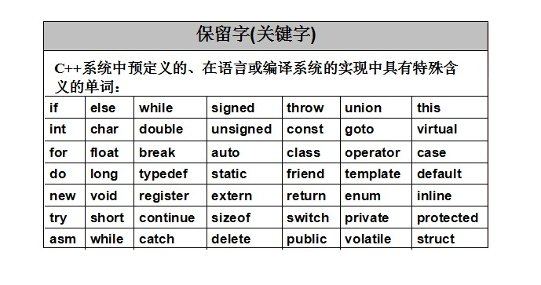

# 一、基础语法

> 在工程文件中添加 CONFIG += console ，作用使用外部控制台输入输出

## 1 初识C++

### 1.1 计算机基础

* **计算机**是一种按照预先编写好的程序**处理各种信息**的现代化电子设备。
* 计算机由**输入输出设备（信息传输）**和**主机（信息处理）**组成
  * 输入设备：鼠标键盘、触控屏
  * 主机：存储器、运算器、控制器
  * 输出设备：显示器、机器人

* 计算机语言是什么？介于计算机和人之间的一个中间语言
  * 人 <-C++-> 编译器 <-0和1-> 计算机
  
* 那我们要怎么和计算机交流
  * 第一步干嘛第二步干嘛。  比如我们怎么把大象塞进冰箱，第一步打开冰箱，第二步把大象装进冰箱，第三步关闭冰箱。
  
* 程序 = 数据结构 + 算法
  * 数据结构：用来描述数据在计算机中如何存储。
  * 算法：用来描述数据如何高效的处理。

### 1.2 熟悉开发环境

* 熟悉开发环境（Qt Creator）
* 熟悉基本开发流程
  1. 创建项目
  2. 创建文件
  3. 编写代码
  4. 编译运行程序
* 编写hello world程序

```c++
#include <iostream>
int main()
{
    std::cout << "Hello World" << std::endl;
	return 0;
}
```


### 1.3 注释

* **作用**：给代码做一些说明，方便直接或其他人阅读代码含义，对程序编译并无实际意义。也就是说编译器在编译代码时会自动忽略注释的内容。

```c
//单行注释
/*
	多行
	注释
*/
```

### 1.4 变量

* **作用**：申请一段内存空间，并给此内存空间起名，方便操作这段内存。

  ```c++
  //数据类型 变量名 = 初始值
  int a = 100;
  ```

### 1.5 常量

* **作用**：用于在内存中存储程序中不可更改的数据，并起一个名字。

  ```c++
  //直接常量的替换
  #define PI 3.1415
  //修饰变量为不可更改
  const int variable = 1112;
  //尝试去修改会无法修改
  ```

### 1.6 标识符名规则

* **作用**：C++规定给标识符（变量或常量）命名有自己的一套规矩。

  * 标识符不能是关键字
  * 标识符只能由字母、数字或下划线组成
  * 标识符第一个字符必须为下划线或字母
  * C++中标识符区分大小写

* **常用命名方案**：（拓展知识）

  * 函数名使用驼峰式命名

    ```c++
    setStyleSheet();
    ```

  * 类名使用首字母大写

    ```c++
    QObject obj;
    ```

  * 常量名全部字母大写

    ```c++
    #define Q_DECLARE_METATYPE(x) x*2
    ```

  * 变量名使用匈牙利命名

    * 属性

    | 前缀 | 意义          |
    | ---- | ------------- |
    | g_   | 全局变量      |
    | c_   | 常量          |
    | m_   | C++类成员变量 |
    | s_   | 静态变量      |

    * 类型

    | 前缀     | 意义                   |
    | -------- | ---------------------- |
    | p        | 指针                   |
    | fn       | 函数                   |
    | v        | 无效                   |
    | h        | 句柄                   |
    | l        | 长整型                 |
    | b        | 布尔                   |
    | f        | 浮点型（有时也指文件） |
    | d        | 双精度浮点             |
    | i        | 整型                   |
    | n        | 短整型                 |
    | s/sz/str | 字符串                 |
    | c/ch     | 字符                   |
    | u        | 无符号                 |
    | by       | 字节                   |
    | w        | 字                     |
    | dw       | 双字                   |

    * 描述

    | 前缀 | 意义     |
    | ---- | -------- |
    | Max  | 最大     |
    | Min  | 最小     |
    | Init | 初始化   |
    | Tmp  | 临时变量 |
    | Cnt  | 计数     |
    | Src  | 源对象   |
    | Dst  | 目标对象 |

### 1.7 关键字（保留字）

* **作用**：C++系统预先保留的标识符，每个C++关键字都有特殊的含义。



### 1.8 数据输出cout

* **作用**：把数据输出到屏幕上显示

```c++
#include <iostream>
int a;
std::cout << a << std::endl;


//可以在屏幕上输出c++标准类型变量的值
//std::endl代表的是换行
//std::cout可以想象成屏幕，<<a 看成把数据a流入屏幕
```

<br>

## 2 数据类型

> c++内置基本数据类型，这些类型本质的区别就是声明的变量所占内存空间和空间对该类型的表示不同

### 2.1 整型

* **作用**：用来声明整数类型的变量

* 不同整型的意义在于，程序员可以根据任务的需求给变量分配合理的内存空间。（为了避免浪费内存，因为早期计算机内存是很小的）

  | 数据类型  | 占用空间                                      | 取值范围                                                | 名称     |
  | :-------- | :-------------------------------------------- | :------------------------------------------------------ | -------- |
  | short int | 2 个字节                                      | -32768 到 32767                                         | 短整型   |
  | int       | 4 个字节                                      | -2147483648 到 2147483647                               | 整数型   |
  | long int  | windows和Linux32位为4个字节，Linux64为8个字节 | -----------------------------------------------------   | 长整型   |
  | long long | 8个字节                                       | -9,223,372,036,854,775,808 到 9,223,372,036,854,775,807 | 长长整型 |


* 使用修饰符`unsigned`可以改变整型取值范围只为正整数

  ```c++
  //a存储的范围0~2^32
  unsigned int a;
  //b存储的范围0~255
  unsigned char b;
  ```

### 2.2 关键字sizeof

* **作用**：计算出**数据类型**或**变量**占用内存的大小

  ```c++
  int a;
  std::cout << sizeof(a) << std::endl;
  std::cout << "long int占用内存的大小" << sizeof(long int) << std::endl;
  ```
  

### 2.3 浮点型

* **作用**：用来声明小数类型的变量
* 不同浮点型区别在于表示有效数字范围的不同。

| 数据类型    | 占用空间 | 取值范围        | 名称           |
| :---------- | :------- | :-------------- | -------------- |
| float       | 4个字节  | 7位有效数字     | 单精度浮点型   |
| double      | 8 个字节 | 15~16位有效数字 | 双精度浮点型   |
| long double | 16个字节 | 18-19位有效数字 | 长双精度浮点型 |

* 有效数字是指包括整数部位和小数部位

  ```c++
  float f1 = 3.14;	//编译器默认会把3.14当成双精度浮点型
  float f2 = 3.14f;	//单精度浮点型
  
  //科学计数法表示
  double d2 = 2e5;		//2*10^5
  double d3 = 2e-4;		//2*0.1^4
  
  //有效数字的验证
  #include <iomanip>
  float f1 = 3.1415926f;
  double d1 = 3.1415926123;
  //	默认精度为6位	
  std::cout << f1 << "  " << d1 << std::endl;
  std::cout.precision(15);//修改输出精度为15位       
  std::cout << d1 << std::endl;
  ```

### 2.4 字符型

* **作用**：用来储存单个字符

| 数据类型 | 占用空间 | 取值范围 | 名称   |
| :------- | :------- | :------- | ------ |
| char     | 1个字节  | 0~255    | 字符型 |

* 计算机存储一个字符是存储一个数字，再根据数字与字符映射找到对应的字符。ASCII码表就是一个字符映射表。

  | ASCII值 | 控制字符 | ASCII值 | 控制字符 | ASCII值 | 控制字符 | ASCII值 | 控制字符 |
  | :------ | :------- | :------ | :------- | :------ | :------- | :------ | :------- |
  | 0       | NUT '\0' | 32      | (space)  | 64      | @        | 96      | 、       |
  | 1       | SOH      | 33      | !        | 65      | A        | 97      | a        |
  | 2       | STX      | 34      | "        | 66      | B        | 98      | b        |
  | 3       | ETX      | 35      | #        | 67      | C        | 99      | c        |
  | 4       | EOT      | 36      | $        | 68      | D        | 100     | d        |
  | 5       | ENQ      | 37      | %        | 69      | E        | 101     | e        |
  | 6       | ACK      | 38      | &        | 70      | F        | 102     | f        |
  | 7       | BEL      | 39      | ,        | 71      | G        | 103     | g        |
  | 8       | BS       | 40      | (        | 72      | H        | 104     | h        |
  | 9       | HT       | 41      | )        | 73      | I        | 105     | i        |
  | 10      | LF       | 42      | *        | 74      | J        | 106     | j        |
  | 11      | VT       | 43      | +        | 75      | K        | 107     | k        |
  | 12      | FF       | 44      | ,        | 76      | L        | 108     | l        |
  | 13      | CR       | 45      | -        | 77      | M        | 109     | m        |
  | 14      | SO       | 46      | .        | 78      | N        | 110     | n        |
  | 15      | SI       | 47      | /        | 79      | O        | 111     | o        |
  | 16      | DLE      | 48      | 0        | 80      | P        | 112     | p        |
  | 17      | DCI      | 49      | 1        | 81      | Q        | 113     | q        |
  | 18      | DC2      | 50      | 2        | 82      | R        | 114     | r        |
  | 19      | DC3      | 51      | 3        | 83      | S        | 115     | s        |
  | 20      | DC4      | 52      | 4        | 84      | T        | 116     | t        |
  | 21      | NAK      | 53      | 5        | 85      | U        | 117     | u        |
  | 22      | SYN      | 54      | 6        | 86      | V        | 118     | v        |
  | 23      | TB       | 55      | 7        | 87      | W        | 119     | w        |
  | 24      | CAN      | 56      | 8        | 88      | X        | 120     | x        |
  | 25      | EM       | 57      | 9        | 89      | Y        | 121     | y        |
  | 26      | SUB      | 58      | :        | 90      | Z        | 122     | z        |
  | 27      | ESC      | 59      | ;        | 91      | [        | 123     | {        |
  | 28      | FS       | 60      | <        | 92      | /        | 124     | \|       |
  | 29      | GS       | 61      | =        | 93      | ]        | 125     | }        |
  | 30      | RS       | 62      | >        | 94      | ^        | 126     | `        |
  | 31      | US       | 63      | ?        | 95      | _        | 127     | DEL      |

* 单个字符使用

  ```c++
  char c1 = 'a';		//‘a’在内存中用97存储
  char c2 = 97;		//97对应的字符是a
  std::cout << c1 << std::endl;
  std::cout << c2 << std::endl;
  std::cout << int(c1) << std::endl;	//强制转换成整数输出
  
  //char c3 = 'abcd'; //错误，单引号不能同时包裹多个字符
  //char c4 = "e";    //错误，双引号包裹的是字符串，无法赋值给字符变量
  ```

### 2.7 字符串型

* **作用**：用来存储一串字符

* 字符串本质由一个一个字符组成的

* **C语言风格字符串**

  ```c++
  char str1[] = "Hello World";
  std::cout << str1 << std::endl;
  std::cout << "Hello C++" << std::endl;
  ```

* **C++风格字符串**

  ```c++
  #include <string>
  
  std::string str2 = "Hello World";
  std::cout << str2 << std::endl;
  ```

### 2.6 转义字符

* **作用**：用来表示一些不显示的字符。

* **解释**：键盘上的a、b、&、=...输入什么就现实什么，这些是可显示字符。回车、换页、字符串结尾符、双引号这种不好表示的字符，c++中使用转义的方式来表示。以反斜杠`\`开头给字符转义。

  | 转义字符 | 意义                                | ASCII码值（十进制） |
  | -------- | ----------------------------------- | ------------------- |
  | \a       | 响铃(BEL)                           | 007                 |
  | \b       | 退格(BS) ，将当前位置移到前一列     | 008                 |
  | \f       | 换页(FF)，将当前位置移到下页开头    | 012                 |
  | \n       | 换行(LF) ，将当前位置移到下一行开头 | 010                 |
  | \r       | 回车(CR) ，将当前位置移到本行开头   | 013                 |
  | \t       | 水平制表(HT)                        | 009                 |
  | \v       | 垂直制表(VT)                        | 011                 |
  | \\'      | 单引号                              | 039                 |
  | \\"      | 双引号                              | 034                 |
  | \\\      | 反斜杠                              | 092                 |

* 转义字符应用

  ```c++
  char str1[] = "123456";
  char str2[] = "123\n456";   //\符号把n的意思改为换行
  std::cout << str1 << std::endl;
  std::cout << str2 << std::endl;
  std::cout << "Hello World\n";
  ```

### 2.7 布尔型

* **作用**：用来储存真或者假两种状态的值

  | 数据类型 | 占用空间 | 取值范围 | 名称   |
  | :------- | :------- | :------- | ------ |
  | bool     | 1位      | 0或1     | 布尔型 |

* 本质：`true`内存中存储的是`1`，`false`内存中存储的是`0`。

  ```c++
  bool b1 = true;
  std::cout << b1 << std::endl;
  b1 = false;
  std::cout << b1 << std::endl;
  ```

### 2.8 数据输入cin

* **作用**：从键盘上获取输入数据存储到变量中

```c++
int a1;
std::cout << "整型 >>";
std::cin >> a1;
std::cout << "1、整型：" << a1 << std::endl;

double a2;
std::cout << "浮点型 >>";
std::cin >> a2;
std::cout << "2、浮点型：" << a2 << std::endl;

char a3;
std::cout << "字符型 >>";
std::cin >> a3;
std::cout << "3、字符型：" << a3 << std::endl;

char a4[100];
std::cout << "字符串型 >>";
std::cin >> a4;
std::cout << "4、字符串形（c风格）：" << a4 << std::endl;

std::string a5;
std::cout << "字符串型 >>";
std::cin >> a5;
std::cout << "5、字符串形（c++风格）：" << a5 << std::endl;

bool a6;    //非0的值都代表真
std::cout << "布尔型 >>";
std::cin >> a6;
std::cout << "6、布尔型：" << a6 << std::endl;
```

<br>

## 3 运算符

>  以下部分例子将用此声明，这里声明变量`int a=19,b=20;`

### 3.1 算术运算符

* **作用**：用于数值的基本运算。

  | 运算符 | 名称 | 描述                                     | 实例                                 |
  | ------ | ---- | ---------------------------------------- | ------------------------------------ |
  | +      | 加法 | 把两个操作数相加                         | `a + b` 将得到 39                    |
  | -      | 减法 | 从第一个操作数中减去第二个操作数         | `a - b` 将得到 -1                    |
  | *      | 乘法 | 把两个操作数相乘                         | `a * b` 将得到 380                   |
  | /      | 除法 | 触发运算符，想出后得到商                 | `b / a` 将得到 1                     |
  | %      | 取余 | 取模运算符，整除后的余数（只可用于整数） | `b % a` 将得到 1                     |
  | ++     | 自增 | 自增运算符，整数值增加 1                 | `a++` ，a将变成20，等同于`a = a + 1` |
  | --     | 自减 | 自减运算符，整数值减少 1                 | `a--`，a将变成18，等同于`a = a - 1`  |

* 自增和自减运算符

  ```c++
  int a=20,b=20;
  int c1=a++;			//先赋值再自增
  int c2=++b;			//先自增再赋值
  ```

### 3.2 位运算符

* **作用**：用于对变量二进制进行操作。

* 这里声明变量`char a=0x41,b=0x42;`

  | 运算符 | 名称 | 描述                              | 实例                                                         |
  | :----- | :--- | :-------------------------------- | ------------------------------------------------------------ |
  | &      | 位与 | 有0出0，全1出1                    | a  65  0x41  0b(0100 0001)  <br>b  66  0x42  0b(0100 0010)  <br/>————————————— <br/>  c  64  0x40  0b(0100 0000) |
  | \|     | 位或 | 有1出1，全0出0                    | a  65  0x41  0b(0100 0001)  <br/>b  66  0x42  0b(0100 0010)  <br/>————————————— <br/>c  67  0x40  0b(0100 0011) |
  | ~      | 取反 | 1变0，0变1                        | ~a  65  0x41  0b(0100 0001)  <br/> ————————————— <br/>  c  190  0xbe  0b(1011 1110) |
  | ^      | 异或 | 同出0，异出1                      | a  65  0x41  0b(0100 0001)  <br/>b  66  0x42  0b(0100 0010)  <br/>————————————— <br/>c  03  0x03  0b(0000 0011) |
  | <<     | 左移 | 二进制左移，左边移出省略，右边补0 | b  66  0x42  0b(0100 0010)         <<  2  <br/>————————————————— <br/>c  08  0x08  0b(0000 1000) |
  | >>     | 右移 | 二进制右移，右边移出省略，左边补0 | b  66  0x42  0b(0100 0010)         >>  3  <br/>————————————————— <br/>c  08  0x08  0b(0000 1000) |

### 3.3 赋值运算符

* **作用**：用于将表达式赋值给变量

  | 运算符 | 名称         | 描述                                             | 实例                        |
  | :----- | :----------- | :----------------------------------------------- | --------------------------- |
  | =      | 赋值         | 把右边操作数的值赋给左边操作数                   | `c = a + b `                |
  | +=     | 加等于       | 把右边操作数加上左边操作数的结果赋值给左边操作数 | `a += b`等同于`a = a + b`   |
  | -=     | 减等于       | 把左边操作数减去右边操作数的结果赋值给左边操作数 | `a -= b`等同于`a = a - b`   |
  | *=     | 乘等于       | 把右边操作数乘以左边操作数的结果赋值给左边操作数 | `a *= b`等同于`a = a * b`   |
  | /=     | 除等于       | 把左边操作数除以右边操作数的结果赋值给左边操作数 | `a /= b`等同于`a = a / b`   |
  | %=     | 模等于       | 求两个操作数的模赋值给左边操作数                 | `a %= b`等同于`a = a % b`   |
  | <<=    | 左移赋值     | 自己做左移位                                     | `a <<= b`等同于`a = a << b` |
  | >>=    | 右移赋值     | 自己做右移位                                     | `a >>= b`等同于`a = a >> b` |
  | &=     | 按位与赋值   | 自己做与运算                                     | `a &= b`等同于`a = a & b`   |
  | ^=     | 按位异或赋值 | 自己做异或运算                                   | `a ^= b`等同于`a = a ^ b`   |
  | \|=    | 按位或赋值   | 自己做或运算                                     | `a |= b`等同于`a = a | b`   |

### 3.4 关系运算符

* **作用**：用于表达式的比较，返回一个布尔值。

  | 运算符 | 名称     | 描述                                                         | 实例            |
  | :----- | :------- | :----------------------------------------------------------- | --------------- |
  | ==     | 相等于   | 检查两个操作数的值是否相等，如果相等则条件为真。             | (a == b) 返回假 |
  | !=     | 不等于   | 检查两个操作数的值是否相等，如果不相等则条件为真。           | (a != b) 返回真 |
  | >      | 大于     | 检查左操作数的值是否大于右操作数的值，如果是则条件为真。     | (a > b)  返回假 |
  | <      | 小于     | 检查左操作数的值是否小于右操作数的值，如果是则条件为真。     | (a < b) 返回真  |
  | >=     | 大于等于 | 检查左操作数的值是否大于或等于右操作数的值，如果是则条件为真。 | (a >= b) 返回假 |
  | <=     | 小于等于 | 检查左操作数的值是否小于或等于右操作数的值，如果是则条件为真。 | (a <= b) 返回真 |

### 3.5 逻辑运算符

* **作用**：用于表达式的比较，返回一个布尔值。

* 这里声明变量`bool a=true,b=false;`

  | 运算符 | 名称 | 描述                                                         | 实例              |
  | :----- | :--- | :----------------------------------------------------------- | ----------------- |
  | &&     | 与   | 如果两个操作数都非零，则条件为真。                           | (a && b) 返回假   |
  | \|\|   | 或   | 如果两个操作数中有任意一个非零，则条件为真。                 | (a \|\| b) 返回真 |
  | !      | 非   | 用来逆转操作数的逻辑状态。如果条件为真则逻辑非运算符将使其为假。 | !(a && b) 返回真  |

<br>

## 4 程序流程结构

* 程序最基本的三种结构：顺序结构、选择结构、循环结构。
  * **顺序结构**：程序从上往下执行。
  * **选择结构**：根据条件有选择的执行功能代码。
  * **循环结构**：根据条件重复执行某段代码。

### 4.1 判断结构

* **作用**：执行满足条件的代码块。

  

* 语法规则和示例

  ```c++
  /*
  	if(条件){
  		//条件为真执行的代码
  	}else{
  		//可选
  		//条件为假执行的代码
  	}
  */
  ```

  * 单行if语句

  ```c++
  if(a>=60){
      cout << "你的成绩及格了" << endl;
  }
  cout << "成绩为：" << a << endl;
  ```

  * 多行if语句

  ```c++
  if(a>=60){
      cout << "你的成绩及格了" << endl;
  }else{
      cout << "你的成绩不及格" << endl;
  }
  cout << "成绩为：" << a << endl;
  ```

  * if语句嵌套和多分支if语句

    * 现在有个需求，要求求出用户输入分数，输出分数的档次。

    ```c++
    //嵌套if语句实现
    if(a>=60){
        if(a>=70){
            if(a>=85){
                cout << "你的成绩优秀" << endl;
            }else{
                cout << "你的成绩良好" << endl;
            }
        }else{
            cout << "你的成绩合格" << endl;
        }
    }else{
        cout << "你的成绩不及格" << endl;
    }
    
    //if else语法实现
    if(a>=85){
        cout << "你的成绩优秀" << endl;
    }else if(a>=70){
        cout << "你的成绩良好" << endl;
    }else if(a>=60){
        cout << "你的成绩合格" << endl;
    }else{
        cout << "你的成绩不及格" << endl;
    }
    ```

  * **练习案例1**：输入3个数，找到里面最大的数。

    ```c++
    if(a>b){
        if(a>c){
            cout << "最大数为：" << a << endl;
        }else{
            cout << "最大数为：" << c << endl;
        }
    }else{
        if(b>c){
            cout << "最大数为：" << b << endl;
        }else{
            cout << "最大数为：" << c << endl;
        }
    }
    ```

#### 4.1.2 三元运算符

* **作用**：实现简单的判断语句。

  

* 语法规则和示例

  ```c++
  //返回较大的值
  c = a > b ? a : b;
  
  //c++中的三元表达式会返回变量
  //a和b谁大就给谁赋值
  (a > b ? a : b) = 100;
  
  //打印较大值
  a > b ? (cout << a) : (cout << b);
  ```

#### 4.1.3 switch语句

* **作用**：执行多情况分支语句

  

* 语法规则和示例

  ```c++
  /*
      switch(值表达式){
          case 值1:
              // 代码块1 
             break; 
          case 值2  :
              // 代码块2 
             break; 
             
  // ...可以有任意数量的 case 语句 
              
          default :
             //  以上条件都不满足执行的代码块代码块 
             break;
      }
  */
  ```

  * **值表达式**：必须是一个整型或枚举类型。

  * case 的 **值** 必须与 switch 中的**值表达式**具有相同的数据类型，且必须是一个常量或字面量。

  * 执行代码块当遇到`break;`时将跳出switch语句。

    ```c++
    char grade = 'B';
    switch(grade)
    {
        case 'A' :
            printf("很棒！\n" );
            break;
        case 'B' :
            printf("很好\n" );
            break;
        case 'C' :
            printf("您通过了\n" );
            break;
        case 'D' :
            printf("最好再试一下\n" );
            break;
        default :
            printf("无效的成绩\n" );
    }
    ```

  * switch中可以有任意数量的 case 语句，case语句执行的范围直到下一个break。

    ```c++
    //根据上面的规则可以让多种情况执行同一条语句
    switch(c){
        case 1:case 2:case 3:
            cout << "1~3" << endl;
            break;
        default:
            cout << "非1~3" << endl;
            break;
    }
    ```

### 4.2 循环语句

* **作用**：多次执行同一块代码。

#### 4.2.1 while循环

* **作用**：先判断循环条件是否满足条件，来实现多次执行同一块代码。

  

* 语法规则

  ```c++
  /*
      while(循环条件)
      {
        	//循环语句
      }
  */
  ```

* 打印数字1~100

  ```c++
  //如果没有循环
  cout << 1 << endl;
  cout << 2 << endl;
  cout << 3 << endl;
  	/* ...要写到何时... */
  
  //循环打印1~100
  int i=0;
  while(i<=100){
      cout << i << endl;
      i++;
  }
  ```

* 死循环

  ```c++
  while(1){
  	cout << 666 << endl;
  }
  ```

* **练习案例2**：求n的乘阶段。例如：3的乘阶1x2x3，5的乘阶1x2x3x4x5。

  ```c++
  int i=1;
  while(i<=n){
      res = res*i;
      i++;
  }
  cout << n << "的乘阶为" <<res << endl;
  ```


#### 4.2.2 do-while循环

* **作用**：先执行一次循环语句，再判断循环条件是否继续执行循环语句。

  

* **练习案例3**：系统随机生成一个数字，用户去猜这个数字。

  * C++随机数用法

  ```c++
  #include <cstdlib>
  #include <ctime>
  
  //计算机中因为是伪随机数，所以要用时间当随机种子
  srand((unsigned)time(NULL));
  //生成[0,100)的随机数
  int val = rand() % 100;
  ```

  * 实现思路

  ```c++
  int a;
  do {
      cin >> a;
      if (a > randValue) {
          cout << "大了！" << endl;
      } else if (a < randValue) {
          cout << "小了！" << endl;
      }
  } while (a != randValue);
  cout << "你猜对了，当前产生的数字是：" << randValue << endl;
  ```

#### 4.2.3 for循环

* **作用**：循环允许您编写一个执行指定次数的循环控制结构。

  

* 语法规则

  ```c++
  /*
  	for( 初始化; 循环条件; 末尾循环体)
      {
         //循环语句
      }
  */
  ```

  * **初始化**：for循环之前执行，且只会执行一次。一般用于循环变量的初始化。
  * **循环条件**：就像while循环一样在每次循环开始时执行，判断条件是否为真，为真执行循环语句，为假跳出循环。
  * **末尾循环体**：在每次执行完循环代码，在执行循环条件之前都会先执行末尾循环体。

* 打印0~100的值

  ```c++
  for(int i=0;i<=100;i++){
  	cout << i << endl;
  }
  ```

* while循环能做的事情for循环都能做，使用for循环完成【练习案例2】

  ```c++
  for(int i=1;i<=n;i++){
      res = res*i;
  }
  cout << n << "的乘阶为" <<res << endl;
  ```

* 死循环

  ```c++
  for(;;){
  	cout << 666 << endl;
  }
  ```

#### 4.2.4 循环嵌套

* **作用**：允许在一个循环内使用另一个循环。

* **练习案例4**：用户输入一个数字n，屏幕上打印n*n的正方形字符

  

  ```c++
  for(int row = 0;row < n;row++){
      for(int col = 0;col < n;col++){
          cout << "* ";
      }
      cout << endl;
  }
  ```

* **练习案例5**：用户输入一个数字n，屏幕上打印n*n的三角形字符

  

  ```c++
  for(int row = 1;row <= n;row++){
      for(int col = 1;col <= row;col++){
          cout << "* ";
      }
      cout << endl;
  }
  ```

* **练习案例6**：打印乘法口诀表

  

  ```c++
  for(int i=1;i<=9;i++){
      for(int j=1;j<=i;j++){
          cout << i << "x" << j << "=" << i*j << "  ";
      }
      cout << endl;
  }
  ```

### 4.3 流程控制语句

#### 4.3.1 break语句

* **作用**：用于提前跳出**循环结构**或者**`switch`语句**

* 当 `break`语句出现在一个循环内时，循环会立即终止，并跳出到循环外第一条语句。

  ```c++
  int i = 0, sum = 0;
  while (true) {
      sum += i;
      //当sum大于5000时提前退出循环
      if (sum > 5000) break;	//会直接跳到循环外第一条语句
      i++;
  }
  cout << sum << "-" << i << endl;	//break后执行的第一条语句
  ```

* dowhile和for循环同理

  ```c++
  for (int i = 0; i < 10; i++) {
      cout << "代码块1：" << i << endl;
      if (i == 5) break;
      cout << "代码块2：" << i  << endl;
  }
  cout << "出循环了：" << endl;
  ```

* 当出现嵌套循环的情况下，`break`只能跳出一层循环。

  ```c++
  for(int i=0;i<n;i++){		
      for(int j=0;j<n;j++){		
          cout << "* ";
          if(i==5 && j==5)break;	//只能跳一层循环
      }
      cout << endl;
  }
  ```

* 它可用于终止`switch`语句中的一个 `case`。（这里不再赘述）

#### 4.3.2 continue语句

* **作用**：跳过当前循环中后面的代码，强迫开始下一次循环。

* 对于 while 和 do...while 循环，`continue`语句重新执行条件判断语句。

  ```c++
  int i = 0;
  while (i < 10) {
      cout << i << " 代码块1" << endl;
  
      if (i == 3) {
          i++;
          continue;
      }
  
      cout << "  代码块2" << endl;
      i++;
  }
  ```

* 对于 for循环，`continue`语句执行后自增语句仍然会执行。

  * 输出100以内的全部偶数

  ```c++
  for (int i = 0; i < 100; i++) {
      //奇数就不输出
      if (i % 2 == 1) continue;
      cout << i << endl;
  }
  ```

#### 4.3.3 goto语句

* **作用**：允许把控制无条件转移到同一函数内的任何被标记的语句。

  

  ```c++
  for (int i = 0; i < 10; i++) {
      cout << i << " 代码块1" << endl;
      if (i == 3) goto out;
      cout << "  代码块2" << endl;
  }
  cout << "循环外第一条语句" << endl;
  out:
  cout << "循环外第二条语句" << endl;
  ```

* 在任何编程语言中，都不建议使用 `goto`语句。因为它使得程序的控制流难以跟踪，使程序难以理解和难以修改。任何能够使用`goto`语句的地方都可以改成非 `goto`语句替代。

* 不过用`goto`语句来跳出多层循环还是蛮方便的

  ```c++
  for (int i = 0; i < 10; i++) {
      for (int j = 0; j < 10; j++) {
          if (i == 5 && j == 5) goto break2for;
          cout << "* ";
      }
      cout << endl;
  }
  break2for:
    cout << "\n已经跳出两层循环\n";
  ```

<br>

## 5 数组

* **作用**：存储多个固定大小相同的数据类型变量。

  

* 数组的每个元素都是由相同数据类型组成，且数组在内存中是连续分布的。这里我将数组的每一项称为元素。

### 5.1 数组初识

* 一维数组的声明与初始化

  ```c++
  //单纯声明一个数组
  //数据类型 数组名[数组长度];
  int arr1[10];
  
  //初始化数组每个元素的内存
  //数据类型 数组名[数组长度] = {数据1，数据2，数据3...};
  int arr2[5] = {12,22,45,64,78};
  
  //这种方式会根据初始化元素的个数自动计算数组长度
  //数据类型 数组名[] = {数据1，数据2，数据3...};
  int arr3[] = {12,22,45,64,78};
  ```

* 一维数组元素的基本操作

  ```c++
  //赋值
  arr2[0] = 1;
  arr2[4] = 4;
  //arr2[5] = 5;//错误，数组访问越界
  
  //访问
  int a = arr2[4];
  //a = arr2[5];//错误，数组访问越界
  ```

### 5.2 数组名用途

* **作用**：获取数组在内存中的首地址。

  ```c++
  int arr[] = {0,10,20,30,40,50,60,70,80,90};
  cout << "数组的首地址：" << arr << endl;
  ```

* 通过sizeof关键字获取数组长度

  ```c++
  int arr[] = {0,10,20,30,40,50,60,70,80,90};
  cout << "数组占用的内存空间：" << sizeof(arr) << endl;
  cout << "数组中单个元素占用的内存空间：" << sizeof(arr[0]) << endl;
  cout << "数组中元素的个数：" << sizeof(arr) / sizeof(arr[0]) << endl;
  ```

* **练习案例1**：输入若干个学生成绩。

  1. 计算出平均成绩。
  2. 找出最高和最低的成绩。

  ```c++
  const int len = 9;
  int arr[len] = {0, 10, 20, 30, 40, 50, 60, 70, 80};
  
  int max = 0, min = 9999, avr = 0;
  for (int i = 0; i < len; i++) {
      //找到最大值
      if (arr[i] > max) max = arr[i];
  
      //找到最小值
      if (arr[i] < min) min = arr[i];
  
      //累加全部成绩
      avr = avr + arr[i];
  }
  avr = avr / len;  //计算平均成绩
  ```

* **练习案例2**：交换两个元素。（一个思路是创建一个临时变量去过度）

  ```c++
  int a,b,temp;
  temp = a;
  b = a;
  a = temp;
  ```

* **练习案例3**：将数组原始逆置存放。

  * 例如：输入：`{1,5,3,8,5}`，输出`{5,8,3,5,1}`

  ```c++
  const int len = 9;
  int arr[len] = {0, 10, 20, 30, 40, 50, 60, 70, 80};
  
  for (int i = 0; i < len / 2; i++) {
      int t = arr[i];     //缓存第一个元素
      arr[i] = arr[len-i];  //第一个元素值改为最后一个元素
      arr[9-i] = t;       //最后一个元素值改为第一个元素的缓存
  }
  
  for (int i = 0; i < len; i++) {
  	cout << arr[i] << endl;
  }
  ```

* **练习案例4**：冒泡排序算法。一种常用的算法，对数组内元素进行排序。

  * 算法思路：以`{4, 1, 6, 8, 7, 2, 3, 9, 5}`为例子。

  

  1. 比较相邻的元素。如果第一个比第二个大，就交换他们两个。
  2. 对每一对相邻元素作同样的工作，从开始第一对到结尾的最后一对。这步做完后，**最后的元素会是最大的数**。
  3. 针对所有的元素重复以上的步骤，除了最后一个。

  ```c++
  const int len = 9;
  int arr[len] = {4, 1, 6, 8, 7, 2, 3, 9, 5};
  
  for (int i = 0; i < len - 1; i++) {
      for (int j = 0; j < (len - 1 - i); j++) {
          if (arr[j] > arr[j + 1]) {
              int temp = arr[j];
              arr[j] = arr[j + 1];
              arr[j + 1] = temp;
          }
      }
  }
  ```

### 5.3 二维数组

* **本质**：就是在一维数组上增加了一个维度。其访问和定义与一维数组一致。

* 二维数组的声明与初始化

  ```c++
  //数据类型 数组名[行数][列数] = {{元素1, 元素2...}, {元素10, 元素20...}}
  int a[3][4] = {  
   {0, 1, 2, 3} ,   
   {4, 5, 6, 7} ,  
   {8, 9, 10, 11}   
  };
  ```

* 二维数组元素的基本操作

  

  ```c++
  a[1][1] = 100;
  ```

* 数组名操作和意义

  ```c++
  cout << "数组占用内存空间的大小：" << sizeof(a) << endl;
  cout << "第0行数组占用内存空间的大小：" << sizeof(a[0]) << endl;
  cout << "第0行第0列元素占用内存空间的大小：" << sizeof(a[0][0]) << endl;
  cout << "全部数组的元素个数：" << sizeof(a)/sizeof(a[0][1]) << endl;
  cout << "数组的列数：" << sizeof(a[0])/sizeof(a[0][1]) << endl;
  cout << "数组的行数：" << sizeof(arr)/sizeof(arr[0]) << endl;
  
  cout << "数组的首地址：" << a << endl;
  cout << "第一行数组的首地址：" << a[0] << endl;
  cout << "第二行数组的首地址：" << a[1] << endl;
  ```

* 多维数组：三维数组就是在二维数组上多了一个维度。

  ```c++
  /*
  	数据类型 数组名[高数][行数][列数] = {
  		{{元素1, 元素2...}, {元素10, 元素20...},...},
  		{{元素1, 元素2...}, {元素10, 元素20...},...},
  		...
       };
  */
  int arr[2][3][4] = {
      {
          {0, 1, 2, 3} ,
          {4, 5, 6, 7} ,
          {8, 9, 10, 11}
      },
      {
          {10, 11, 12, 13} ,
          {14, 15, 16, 17} ,
          {18, 19, 110, 111}
      }
  };
  ```

<br>

## 6 函数

* **作用**：封装一组一起执行一个任务的语句。（增加代码可读性，减少重复代码）

* 每个 C 程序都至少有一个函数，即主函数 **main()**。

### 6.1 函数的定义

* 定义语法

  ```c++
  /*
      返回类型 函数名( 参数列表... )
      {
         函数代码
         return 返回值;
      }
  */
  ```

  * **返回类型：**函数返回值的类型。如果没有返回值使用`void`。
  * **函数名称：**这是函数的名字。函数名和参数列表一起构成了函数签名。
  * **参数：**参数就像是占位符。当函数被调用时，您向参数传递一个值，这个值被称为实际参数。
    * 参数列表包括函数参数的类型、顺序、数量。
    * 参数是可选的，也就是说，函数可能不包含参数。
  * **函数主体：**函数主体包含一组执行特定任务的语句。

* 乘法功能的函数（有参数有返回值）

  ```c++
  //声明
  int mul(int a,int b)
  {
  	int sum = a * b;
      return sum;
  }
  ```

* 有参数无返回值的函数

  ```c++
  void printDouble(double val)
  {
  	cout << val << endl;
  }
  ```

* 无参数有返回值的函数

  ```c++
  //全局变量
  int gA = 1; 
  //函数里面是可以访问到全局变量的
  int getgA()
  {
      gA++;
      return gA;
  }
  ```

* 无参数无返回值的函数

  ```c++
  void print()
  {
      cout << "这是一个打印函数。无参数也无返回值。" << endl;
  }
  ```

### 6.2 函数的调用

* **作用**：执行函数内的语句

* 调用语法

  ```c++
  // 变量 = 函数名(参数...);
  ```

  * **变量**：如果函数有返回值，就拿对应类型的变量去接收返回值。
  * **函数名**：定义的函数名称。
  * **参数**：函数要求传入的参数。类型、顺序、数量必须要正确。

* 函数调用例子

  ```c++
  //调用我们自己声明的函数mul
  int sum = mul(12,22);
  
  //调用c++标准函数（#include <cmath>）
  int val1 = pow(2,8);      //求2的8次方
  double val2 = sqrt(16);   //求16的平方根
  ```

### 6.3 函数传值调用

* **本质**：把参数的实际值复制给函数的形式参数。

* 什么是实参和形参

  ```c++
  void swap(int x, int y)
  {
     int temp;
     temp = x; 
     x = y;    
     y = temp; 
  }
  
  int main()
  {
      int a = 10;
      int b = 20;
      swap(a,b);
      return 0;
  }
  ```

  * **实参**：实际参数，上例中传递进入的a和b就是实参。
  * **形参**：形式参数（过程参数），上例中x和y就是形参，用来替代a和b走过场的。

  ```c++
  //实际中内存是这样的
  int a = 10;
  int b = 20;
  
  //调用到函数，如果函数有参数
  //根据函数的参数定义变量（形参），并把传入实参（实参）赋值给变量（形参）
  {
      int x = a;
      int y = b;
      temp = x; 
      x = y;    
      y = temp; 
  }
  ```

### 6.4 函数的声明

* **作用**：告诉编译器函数如何去调用。（一般用于多文件工程）

* 函数声明和定义可以分开，声明可以多次，但是定义只能一次。

  ```c++
  //函数声明（注释声明编译报错）
  int add(int a,int b);
  
  int main()
  {
      //函数调用
      cout << add(15,22) << endl;
      return 0;
  }
  
  //函数定义
  int add(int a,int b)
  {
      return a+b;
  }
  ```

* 函数文件分写

  ```c++
  //cal.h
  int add(int a,int b);
  
  //cal.cpp
  #include "cal.h"
  int add(int a,int b)
  {
      return a+b;
  }
  
  //main.cpp
  cout << add(15,22) << endl;
  ```

<br>

## 7 指针

### 7.1 指针初识

* **作用**：可以间接访问内存空间。

* **指针**是一个变量，其值为另一个变量的地址，即，内存位置的直接地址。

* 通过`&`取地址符号，获取变量的*内存地址*。

  ```c++
  int a = 123;
  // 内存地址 = &变量名
  cout << &a;
  ```

* 定义一个能够存储int类型变量a内存地址的变量，也就是指针变量

  ```c++
  // 数据类型 *指针名称 = 内存地址
  int *p = &a;
  ```

* 通过`*`获取该内存地址的*数据值*。

  ```c++
  // 数据值 = *内存地址
  cout << *p;
  ```

* 完整的指针示例

  ```c++
  int a = 123;
  int b = 456;
  //定义一个整型类型的指针变量
  //该变量存储的值为a的地址
  int *p = &a;
  ```

  * 下图展示了上面代码在内存中的关系

  

* 指针变量占用内存空间的大小只由编译器决定。不管什么类型的指针都是一样大的。

  * 32位编译器占4字节。
  * 64位编译器占8字节。

  ```c++
  int *ip;
  double *dp;   
  cout << sizeof(ip) << endl;
  cout << sizeof(dp) << endl;
  ```

* 不同类型的指针是为了区别，指向内存数据的含义。

  ```c++
  int    *ip;    // 指向内存所存储的数据是整数 
  double *dp;    // 指向内存所存储的数据是双精度浮点
  float  *fp;    // 指向内存所存储的数据是浮点数
  char   *cp;    // 指向内存所存储的数据是单字符
  ```

### 7.2 空指针野指针

* **空指针**：不指向任何内存的指针，一般用于初始化指针变量。

  ```c++
  //int *p = NULL;	
  //不建议这么写，因为NULL只是整数0，
  //而nullptr是有类型的，编译器会对其进行检查
  
  //定义一个空int指针，不指向任何内存，其指向的内存是不可访问的
  int *p = nullptr;
  
  //*p = 99;	//可能会发生意外错误
  ```

* **野指针**：指针指向非法的内存地址。

  ```c++
  //我随意让指针指向的内存地址
  int *p = (int*)0xabcdef;
  //这块内存可能被使用了，也可能没有被使用，有时候会造成意想不到的错误
  cout << *p << endl;
  ```

### 7.4 指针与const

* **常量指针**：指针指向的内存地址可以更改，但是指向内存的值无法更改。

  ```c++
  const int *p1 = &a;
  p1 = &b;
  //*p1 = 99;		//错误
  ```

* **指针常量**：指针指向的内存地址无法更改，但是指向内存的值可以更改。

  ```c++
  int *const p1 = &a;
  //p1 = &b;		////错误
  *p1 = 99;		
  ```

* **常量指针常量**：指针指向的内存地址和指向内存的值都无法更改。

  ```c++
  const int *const p1 = &a;
  //p1 = &b;		////错误
  //*p1 = 99;		//错误
  ```

### 7.5 指针与数组

* 数组名就是一个指针常量

  ```c++
  int arr[10] = {10,1,2,3,4,5,6,7,8,9};
  //因为arr是数组的首地址，所以可以像指针一样访问数组第一个元素值
  cout << *arr << endl;
  ```

* 指针指向数组后，也可以像数组一样访问指针

  ```c++
  int *p = arr;
  p[2] = 700;
  cout << arr[2] << endl;
  ```

### 7.6 指针算术运算

* 指针的类型还有一个作用就是指针做运算时移动的字节。

  ```c++
  int arr[10] = {10,1,2,3,4,5,6,7,8,9};
  int *p = arr;
  p=p+1;
  cout << p[0] << endl;	//结果是1
  p=p+5;
  cout << p[1] << endl;	//结果是7
  p--;
  cout << *p << endl;		//结果是5
  cout << *(p+3) << endl;	//结果是8
  ```

* 因为数组名就是指针常量，所以也可以像指针常量一样使用。

  ```c++
  cout << *(arr+3) << endl;	//结果是3
  ```

### 7.7 指针与函数

* 利用指针作为参数可以修改实参的值

  ```c++
  void swap1(int a,int b)
  {
  	int t = a;
  	a = b;
  	b = t;
  }
  
  void swap2(int *pa,int *pb)
  {
  	int t = *pa;
  	*pa = *pb;
  	*pb = t;
  }
  ```

* 高级应用，对冒泡排序进行封装

  ```C++
  void msort(int arr[],int len);
  ```

### 7.8 指向指针的指针

* **作用**：用来存储指针变量的内存地址

  ```c++
  int a = 99;
  //一级指针，指向a的内存地址
  int *p1 = &a;
  //二级指针，指向p1指针的内存地址
  int **p2 = &p1;
  //三级指针，指向p2指针的内存地址
  int ***p3 = &p2;
  
  //通过p2访问a的值
  cout << **p2 << endl;
  ```

<br>

## 8 结构体

### 8.1 结构体初识

* **作用**：允许用户自定义复合数据类型。

#### 8.1.1 结构体定义

* 语法规则

  ```c++
  /*
  struct 结构体名{
  	结构体成员描述
  };
  */
  ```

* 定义一个可以存储长宽高的数据类型

  ```c++
  struct Box{
      int length;
      int width;
      int height;
  };
  ```

* 再定义一个可以存储学生基本信息的数据类型

  ```c++
  struct Student{
      int age;
      int score;
      string name;
  };
  ```

#### 8.1.2 结构体使用

* 创建自定义类型变量

  ```c++
  //声明结构体变量，顺便初始化数据
  //结构体名 变量名 = {结构体成员列表初始化（数据类型一定要对）}
  Student stu1 = {"王刚", 20, 99};
  
  //声明结构体变量，后一个个成员赋值
  //结构体名 变量名
  Student stu2;
  stu2.name = "李芳";
  stu2.age = 19;
  stu2.score = 88;
  ```

* 获取结构体变量某个元素的值

  ```c++
  cout << stu2.name << "的年龄：" << stu2.age << endl;
  ```

### 8.2 结构体与数组

* **作用**：连续声明多个自定义类型的变量。

* 创建结构体数组

  ```c++
  //结构体名 数组名[元素个数] = {{结构体成员列表初始化},{结构体成员列表初始化},...}
  Student arr[3] = {
      {"王刚", 20, 99},
      {"李芳", 19, 88},
      {"张鸣", 22, 100},
  };
  ```

* 遍历结构体数组的成员

  ```c++
  for(int i=0;i<3;i++){
      cout << arr[i].name  << " ";
      cout << arr[i].age   << " ";
      cout << arr[i].score << " ";
  }
  ```

* 根据姓名修改分数

  ```c++
  string name;
  int score;
  cout << "请输入要修改分数的用户名：";
  cin >> name;
  cout << "请输入修改后的分数";
  cin >> score;
  for (int i = 0; i < 3; i++) {
      if (arr[i].name == name) {
          arr[i].score = score;
      }
  }
  ```

### 8.3 结构体与指针

* 指针使用操作符`->`来访问结构体的成员变量

  ```c++
  Student *sp = &arr[2];
  cout << sp->name  << " ";
  cout << sp->age   << " ";
  cout << sp->score << " ";
  ```

### 8.4 结构体与函数

* 将结构体作为参数传递给函数

  ```c++
  void printStudent(Student stu)
  {
      cout << stu.name << " ";
      cout << stu.age   << " ";
      cout << stu.score << " ";
  }
  ```

* 将结构体的地址传递给函数（速度肯定比传值块，因为传值需要把每一个数据类型都拷贝一份，而穿地只需拷贝一份地址即可）

  ```c++
  void studentScoreAdd10(Student *ps)
  {
      cout << sp->name << " ";
      cout << sp->age   << " ";
      cout << sp->score << " ";
  }
  ```

* 如果传址时不希望函数对数据进行修改，可以加一个`const`修饰，让编译器编译器做检查看是否修改了数据。

  ```c++
  void studentScoreAdd10(const Student *ps)
  ```

### 8.5 结构体案例

* **练习案例1**：输入若干个学生信息，包括姓名，年龄，成绩。可以根据学生姓名删除任意一条数据。

  ```c++
  for(int i=0;i<len;i++){
  	if(arr[i].name == name){
  		for(int j=i;j<(len-1);j++){
  			arr[j] = arr[j+1];
  		}
  	}
  }
  ```

* **练习案例2**：输入若干个学生信息，包括姓名，年龄，成绩。可以根据成绩从高到低给这若干个学生进行排序。

  ```c++
  for (int i = 0; i < len - 1; i++) {
      for (int j = 0; j < (len - 1 - i); j++) {
          if (arr[j].score < arr[j + 1].score) {
              Student temp = arr[j];
              arr[j] = arr[j + 1];
              arr[j + 1] = temp;
          }
      }
  }
  ```

* **练习案例3**：好友管理系统，可以增删改查通讯录全部数据。

  1. 有菜单界面：可以选择相应的功能。
  2. 添加好友：包括姓名、年龄、电话。
  3. 显示好友：显示全部好友。
  4. 删除好友：根据姓名删除某个好友。
  5. 查找好友：根据姓名查找某个好友。
  6. 修改信息：根据姓名查找并更改信息。
  7. 退出系统：结束程序。

## 9 引用

### 9.1 引用初识

* **作用**：给变量起一个别名。

  ```c++
  int a = 99;
  //数据类型 &别名 = 源变量;
  int &b = a;
  b = 88;
  
  //a为b，b为a，两者没有区别
  ```

* 引用必须初始化，且不可以改变引用

  ```c++
  int a1 = 88,a2 = 99;
  //int &b;	//错误，不存在空引用，因为引用的本质是给变量起一个别名
  
  int &b = a1;//一旦初始化后就不可更改
  b = a2		//这里只是把a2的值赋给b与a1，并不是改变引用
  ```

### 9.2 引用与函数

* **作用**：可以代替指针在函数内修改实参。（本质是指针的语法糖）

* 引用作为函数参数

  ```C++
  //引用传递
  void swap1(int &a,int &b){
  	int t = a;
  	a = b;
  	b = t;
  }
  //指针传递
  void swap2(int *pa,int *pb){
  	int t = *pa;
  	*pa = *pb;
  	*pb = t;
  }
  //上面的两个函数可以达到同样的效果
  ```

* 引用作为函数返回值

  ```c++
  //不要返回局部变量引用
  int &fun1(){
      //局部变量，在结束函数时就会被销毁
  	int a = 10;
      return a;
  }
  
  //返回全局或静态变量
  int ga = 99;
  int &fun2(){
      return ga;
  }
  int &fun3(){
      static int a = 9;
  }
  ```

### 9.3 引用本质

* **本质**：引用本质是一个指针常量。这其实是C++的一个语法糖。

  ```c++
  int a = 10;
  
  //转换成 int* const ref = &a;
  int& ref = a;
  
  //转换成 *ref = 20
  ref = 99;
  ```

### 9.4 常量引用

* **作用**：用来防止引用修改源变量。

  ```c++
  void print(const int& val){
  	//val = 100;	//错误
      cout << val << endl;
  }
  ```

<br>

## 10 内存

### 10.1 作用域和生命周期

* **作用域**：可以访问变量的区域。
  - **局部变量**：在函数或一个代码块内部声明的变量。
  
  - **全局变量**：在所有函数外部声明的变量。
  
* **生命周期**：变量在程序中的生存时间。

### 10.2 内存分区


* **作用**：不同内存分区的作用域和生命周期都不同。
  
  1. 代码区：存放程序的代码，即CPU执行的机器指令，并且是只读的。
  
  2. 常量区：存放常量(程序在运行的期间不能够被改变的量，如const修饰变量)
  
     ```c++
     const int a = 100;
     #define IP 3.14
     ```
  
  3. 全局区：存放全局变量和静态变量。此区域的变量生命周期为整个程序运行期间
  
     * 全局变量
  
     ```c++
     int ga = 100;
     int main()
     {
     	//...
     	return 0;
     }
     ```
  
     * 静态变量
  
     ```c++
     int getValue()
     {
     	static int a = 0;
     	a++;
     	return a;
     }
     ```
  
  4. 栈区：存放函数内的局部变量、形参和函数返回值。栈区变量生命周期过了之后系统会自动回收，此区域由系统自动管理栈区的内存(分配内存 , 回收内存)
  
     ```c++
     void fun(int a)
     {
     	int b;
     }
     
     int main()
     {
     	int c;
     	if(1){
     		int d;
     	}
     	return 0;
     }
     //a,b,c,d都是局部变量
     ```
  
  5. 堆区：存放由程序员手动管理内存的分配和释放的内存，这段内存称为动态内存。（在操作系统中分配方式倒是类似于链表）

### 10.3 动态内存申请

#### 10.3.1 new关键字

* **作用**： 在堆区开辟一段任意大小的内存，其生命周期由程序员决定。

  ```c++
  //在堆区创建一个变量        
  //指针 = new 数据类型(初始值)	
  int *p1 = new int(100);
  cout << *p1 << endl;
  
  //在堆区创建一个数组
  //指针 = new 数据类型[数量]{初始值列表}	
  int *p2 = new int[5]{1,2,3,4,5};
  cout << p2[1] << endl;
  ```

* 堆区变量和栈区变量的区别

  ```c++
  int *fun1()
  {
      int *pa = new int(100);
      return pa;
  }
  
  int *fun2()
  {
      int a = 200;
      return &a;
  }
  ```

#### 10.3.2 delete关键字

* **作用**：释放通过`new`申请的内存。

  ```c++
  //delete 指针
  delete p1;
  
  //delete [] 指针
  delete [] p2;	// 删除 p2 所指向的数组
  ```

## 11 函数高级用法

### 1 函数默认参数值

* 函数的形参是可以有默认值的。

  ```c++
  //返回类型 函数名(参数 = 默认值)
  double fun(int a,int b = 1,double c = 3.14){
  	return a*b*c;
  }
  
  //和正常函数一样的调用
  double a = fun(1,2,3.0);
  //最后一个参数省略
  double b = fun(1,2);
  //后两个参数都省略
  double c = fun(2);
  ```

### 2 函数占位参数

* 函数的形参是可以有占位符。调用函数必须填补该位置

  ```c++
  //返回类型 函数名(占位数据类型)
  int fun(int a,int){
     return a*10; 
  }
  
  //必须要填占位符参数
  fun(10,8);
  ```

### 3 函数的重载

* **作用**：相同函数名的函数可以实现不同的功能，提高复用性。
* **本质**：虽然函数名相同，但是编译器会根据参数不同来为每一个函数生成唯一函数标识。

* 函数重载的条件：

  * 函数的名字相同。
  * 函数的**参数类型**或**参数个数**或**参数顺序**不同。

  ```c++
  void fun(string str){
  	cout << str << endl;
  }
  //参数类型不同
  void fun(int val){
      cout << val*99 << endl;
  }
  //参数个数不同
  void fun(){
      cout << "Hello World!" << endl;
  }
  
  //参数顺序不同
  void fun(int a,double b){
  	cout << a << "==="<<b << endl;
  }
  void fun(double b,int a){
  	cout << a << "---"<<b << endl;
  }
  ```

* 函数返回值类型不同不能作为函数的重载条件。

  ```c++
  double fun(){
  	return 3.14;
  }
  string fun(){
      return "3.14";
  }
  ```

* 引用作为函数重载条件

  ```c++
  void fun(int &a){
  	cout << "void fun(int &a)" << endl;
  }
  void fun(const int &a){
  	cout << "const void fun(int &a)" << endl;
  }
  
  int a = 999;
  fun(a);
  fun(123213);
  ```

  
